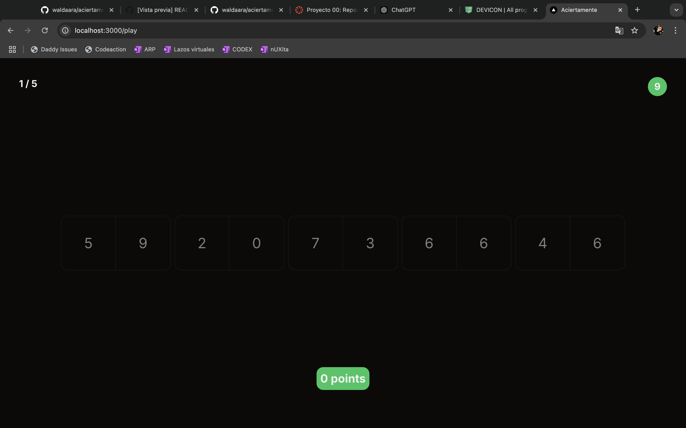
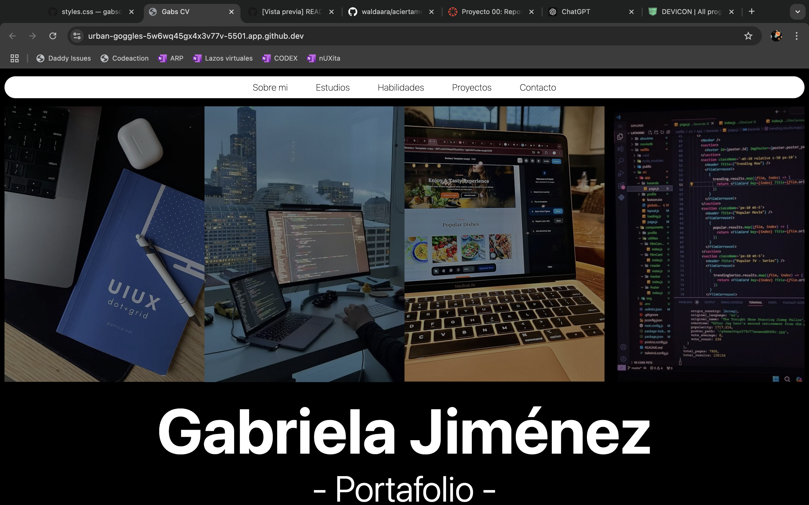

<h1 align="center">Hola 👋, Soy Gabriela Jiménez</h1>

  

<h3 align="center">Apasionada por la computación</h3>
<h3>Datos personales</h3>

- Mi nombre completo es Gabriela de Fátima Jiménez Jiménez 🐢 
- Actualmente me encuentro estudiando en ESPOL la carrera de computación 👩🏻‍💻 
- Mi materia favorita es interacción humano computador 📚 -En mi tiempo libre me gusta leer y armar rompecabezas 🧩

<h3 align="left">Lenguajes y herramientas:</h3>

  
  
  
  
  
  
  
  
  
  
  
  
  
  
  
  
  
  
  
  
  
  
  
  
  
  
  
  
  
  
  
  
  
  
  
  
  
  
  
  
  

<h3 align="left">Proyectos:</h3>
<h4 align="left"><a href="https://github.com/emilybibi04/POO4_PROY2P_Jimenez_Suarez_Valarezo.git">Sistema de Autoservicio para Heladería</a></h4>

Este proyecto consiste en una aplicación de autoservicio diseñada para heladerías. Permite a los clientes realizar pedidos personalizados de helados y gestionar su compra a través de un sistema intuitivo y eficiente. La aplicación está pensada para usarse en máquinas de autoservicio, optimizando la experiencia del cliente al evitar filas y tiempos de espera.  
<b>- Tecnologías usadas:</b>  Java con interfaz gráfica en JavaFX. 
Manejo de archivos para almacenar datos de pedidos, locales y pagos. 
Diseño de clases orientado a objetos. 

  

<h4 align="left"><a href="https://github.com/waldaara/aciertamente.git">Aciertamente</a></h4>

Fue mi proyecto de estadística, trabajé junto mi compañero <a href="https://waldaara.github.io/waldaara/">David Aragundy</a>. Es un proyecto de código abierto donde puedes poner a prueba tu memoria. Tienes 10 segundos para memorizar 10 dígitos y luego escribir lo que recuerdes. Se tiene 5 intentos en total.  <b>-Tecnologías usadas: </b> 
  Docker 
  CSS3 
  ESLint 
  Git 
  GitHub 
  HTML5 
  Next.js 
  Node.js 
  npm 
  PostgreSQL 
  React.js 
  TypeScript 
  Visual Studio Code

  

<h4 align="left"><a href="https://github.com/gabsjimz/gabscurriculum.git">Gab's Curriculum</a></h4>

Uno de mis proyectos del curso de Desarrollo de Aplicaciones Webs y Móviles (DAWN). Ttabajé en un curriculum personal web.   <b>-Tecnologías usadas: </b> HTML: Para la estructura del contenido de la página web. 
CSS: Para el diseño y estilización de la página, aplicando buenas prácticas de diseño web. 
Visual Studio Code (VSC): Como entorno de desarrollo integrado (IDE) para escribir y organizar el código. 
GitHub Pages: Para alojar y desplegar la página web, haciendo que sea accesible a través de una URL pública.

  

<h3 align="left"> Contáctame:</h3>

